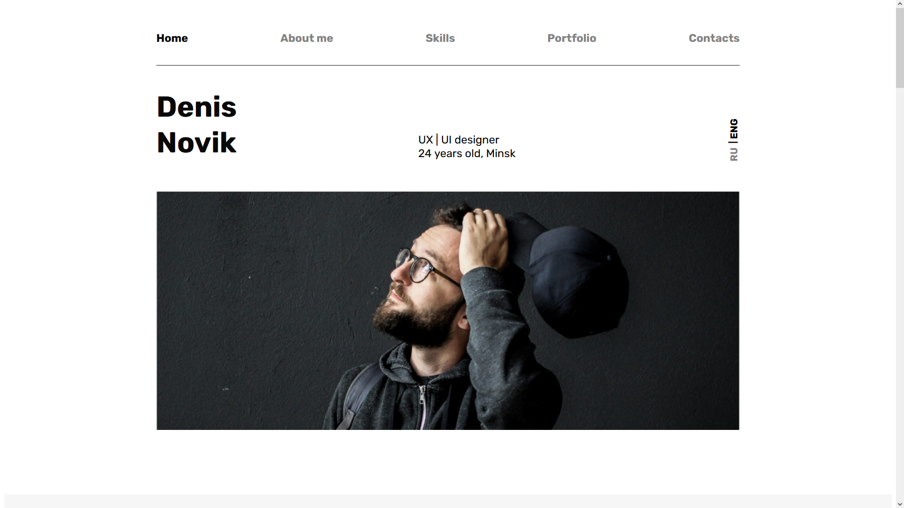

### Шаблон Портфолио

Учебный проект. Задача проекта - углубить знания адаптивной вёрстки, HTML и CSS в целом, реализовать интерактивный попап. 

Проект представляет собой одностраничный лендинг-портфолио.

Перейти на сайт можно по [ссылке](https://pikulinweb.ru/)

#### Технологии использованные при разработке

- HTML
- CSS
- JS

#### Установка проекта

Чтобы запустить проект на своём компьютере, скопируйте репозиторий при помощи команды:

`git clone https://github.com/kanae367/landing-page-template`
